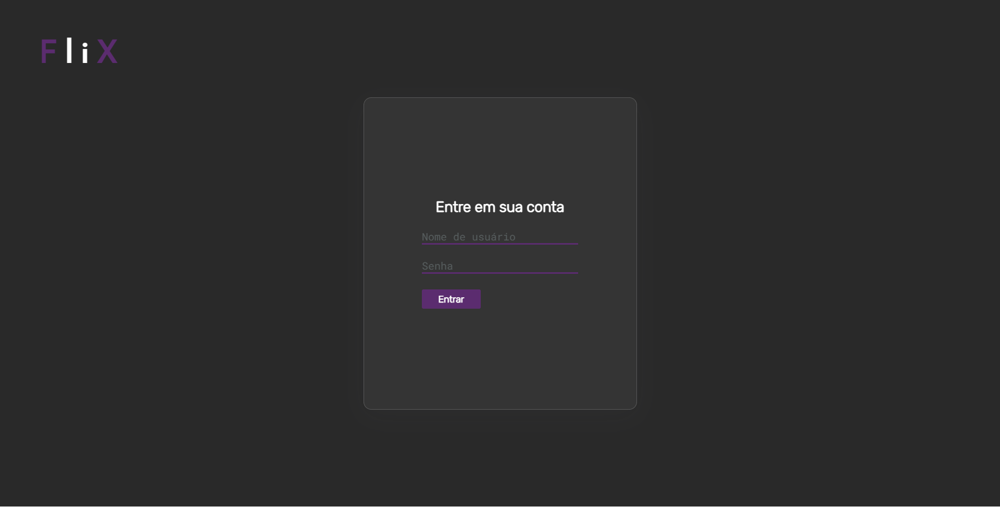

## Hey Dev! 😄

### 🏗️ Projeto:

> Login Page.

[🔗 Link para acessar a página](https://login-page-sable.vercel.app)

#### 🎃 Prévia:

### 🎯 Objetivo:

> Estava com um tempo livre e reoslvi criar um novo projeto para prática de formulários e aumentar meus projetos aqui no GitHub.

#### ✏️ Descrição:

> Uma simples caixinha de login ✨

#### ⚙️ Tecnologias usadas:

> HTML5;

> CSS3;

## Colaboradores:

    
    Evelin-Silva

